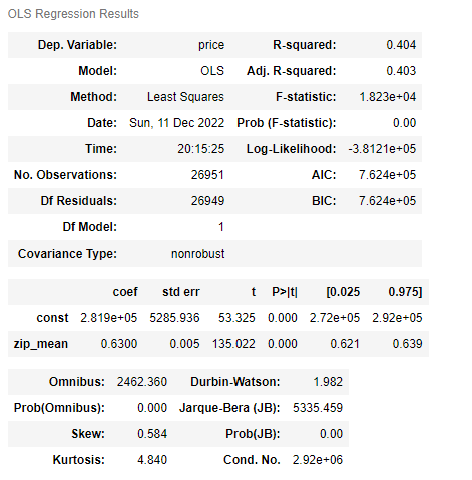
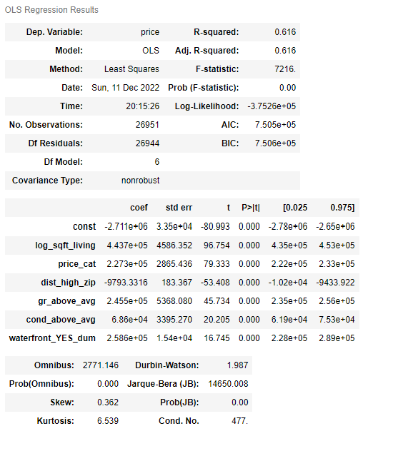
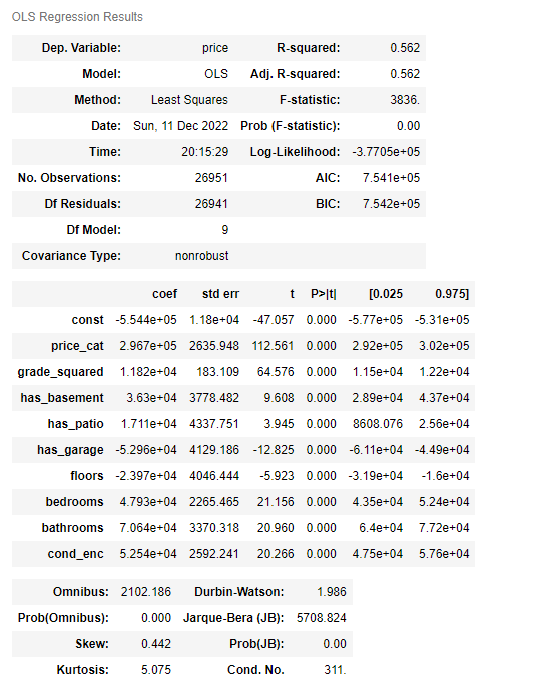

# Overview
 
This project is geared towards finding recommendations for a real estate firm interested in refurbishing and flipping residential properties in the Seattle metropolitan area. The problem we sought to address was how should the firm determine where to look for investment opportunities, and what actions could they take to increase the resale value of the home. Using the King County Housing dataset, we performed exploratory data analysis and built linear regression models to gain insights into the relationships between several independent variables and our target variable, price. We then utilized visualization techniques to present our findings and convey the rationale behind our recommendations to the stakeholder. Finally, we discussed limitations and steps we could take in a follow-up study that would provide additional value to our stakeholders.  

## Business Understanding

Given our stakeholders objective, we focused our analysis around two key considerations. The first was to understand the local market and neighborhood characteristics. Our goal was to identify locations for potential investment opportunities that we could recommend to our stakeholder based upon their budget. We determined which zip codes had the highest and lowest average sales prices, and how proximity to Medina, a wealthy city, affects the average house price. Our second consideration was to determine which types of renovation activities would yield the highest increase in sales price. Our linear regression model led us to focus on the overall condition of the property, as well as thoughtful construction that would increase square footage. 

## Data Understanding

The data set we used consisted of housing sales in King County. The first step was to visual the data set. A map was rendered and we found that the data set contained around 900 entries which were not in the state of Washington. To remedy this, we limited the data by the rough longitude and latitude of the county as this data was included in our data set. We then generated the map shown below to get a good idea of the housing market in King County. We then cleaned the data by converting categorical variables to oridinal and binary data in order to use them for the modelling. Another major feature that we wanted to look into was housing price by zip code and price categories as it appeared that housing prices got lower the further away they were from Medina. We created some additional features to analyse this. We also created a feature that found the distance between a property and the highest price zip code as this appeared to have a relationship. Finally, outliers were removed and any irrelevant data was dropped.

## Data Modelling

The first step in modelling was to use our cleaned data set to find a solid baseline model. Our target variable is price so we checked the correlation to price with all of our variables. We found that the mean zip code prices, a category which took assigned the mean price of the zip code to a property within that zip code, had the highest correlation coefficient, 0.635232. This is not surprising as the variable was built on price so there is bound to be a relationship there. This gave us a decent regression model with a high amount of multicollinearity. The details of the model are shown below. The next step is to find a model with multiple features that does a better job of explaining the changes in price. 

After iteratively building upon the baseline model, we were able to find a model that did a much better job of explaining the change in price while using multiple features. This model had an $r^2$ value of 0.629 which is much better than our baseline, which only had an $r^2$ of 0.404. This model cut down on multicollinearity as well; however, it still appeared to be fairly high. The next step was to try to normalize some of the data to cut down on multicollinearity. This was simply achieved by taking the natural log of the square-foot living space. The final features used for this model were the log of the square foot living, price category, distance to the highest price zip code, grade above average (yes or no), condition above average (yes or no), and waterfront property (yes or no). All of the features were statisically significant for  $\alpha$=.05. 

This model does a good job of explaining the change in price; however, does not provide much information that could be useful to our stakeholders. Most of these variables do not have anything to do with renovations and these features vastly limit the number of properties. For example, there were very few properties on a waterfront. While this is a solid model for the price of houses in King County, it did not help us to reach the goal we set to achieve. Hence, we started work on another model that would provide more useful information for our stakeholders.

Again, using an interative process, we were able to find a model that, while not as strong as the previous, did a better job of providing insights of features relevant to our stakeholders. This model still preformed better than our baseline, with an $r^2$ value of 0.562 and much less multicollinearity. The only normalization that was done to achieve this model was to square the value for grade. This model provided information about how the change in price relates to price category, grade squared, basement (yes or no), patio (yes or no), garage (yes or no), number of floors, number of bedrooms, number of bathrooms, and the condition of the home. These features are much more useful to our stakeholder and we will rely heavily on this model moving forwards.

Before moving forward, we wanted to ensure that our models did not violate too many assumptions. After some analysis, we found that the residuals of the model were fairly normally distributed with a high kurtosis. We also found that the data was somewhat over-dispersed. The data is more widely spread out around our central value than is typical for the normal distribution. Trimming the data further could remedy this but it could take out some important data points. There was also some multicollinearity; however, this is to be expected given the nature of the data and the relationship between many of the variables. Overall, not too many assumptions were violated and both models proved to be a good representation of the changes in price.

## Evaluation

Now that we have our models, we want to explore the features a bit more in order to make informed recommendations to our stakeholders. It is worth noting that the regression models are not predictive, which is why we must find more information on our features. While we explored a wide array of features, only the most relevant will be included here.

One significant feature was price category. To utilize this feature we found the average distance from properties in each category to Medina, as we found that distance from Medina had a strong relationship with price. Since we do not know our stakeholders specific budget, this gives them a rough idea of where properties within their budget may lie.

Another important feature was the size of the house. In order to use this data effectively, we seperated the data into different categories to represent different house sizes. As can be seen below, increasing the size of the home has a positive impact on the price of the home. Therefore, making additions to the home is an important factor in increasing the price and, in turn, the resale value. 

Now that we know additions to the home help to increase the price, we want to look at what renovations are the most significant. From our analysis and modelling, we found that bathrooms were the most impactful on price, followed by bedrooms, basements, patios, and floors. Given that adding a basement, garage, or extra floor are generally expensive projects and appear to be less impactful, it is clear that bathroom and bedroom additions should be first priority. 

The final piece to relation renovations to increased home prices was the condition of the home. We found that the average price of properties did not go up much above an average condition. The largest jumps were from poor condition to fair condition and fair condition to average condition. While these two jumps are comparable, the most logical choice is to improve from fair to average as a poor condition home is categorized as having major structural and functional deficiencies, which would be expensive to repair. In order to bring a fair codityion home up to average condition only minor repairs and some refurbishing would be required. This would leave the largest margin for profit.

## Conclusion

In conclusion, we have two recommendations for our stakeholders. The first is to purchase properties that have a “fair” building condition, and perform the renovations necessary to bring them up to an “average” condition or higher. Our reason for this recommendation is that “fair” condition properties do not require costly structural construction, but could be upgraded to a better condition through maintenance work and refinishing. Our analysis shows a clear price increase in the property as the condition level improves. Our second recommendation is to increase square footage in a thoughtful manner. Specifically, we recommend prioritizing the addition of bathrooms and bedrooms as those features had the biggest positive impact on price. A limitation of this study was the number of renovation features available to analyze. Additionally, we did not have our stakeholders budget and therefore could not recommend specific locations for investment. In a follow up study, we would like to work with the stakeholders budget and also analyze more property features to determine what additional types of renovations could increase resale value.
 